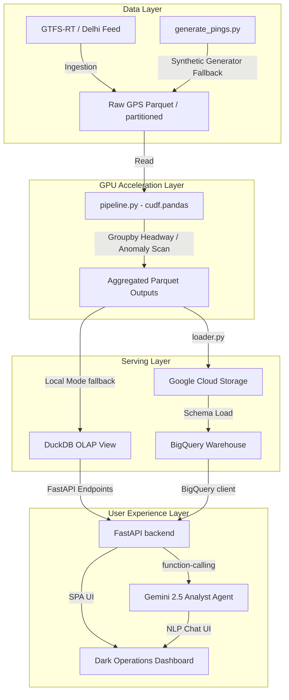

# TransitPulse — GPU-Accelerated Bus Reliability Decision Engine

### 🌐 Live Deployment: [Hugging Face Space](https://huggingface.co/spaces/DeepikaChintamreddy/TransitPulse)

**TransitPulse** is a high-performance operations intelligence dashboard built for the Google Cloud × NVIDIA data intelligence challenge. It ingests large-scale bus GPS telemetry (GTFS-Realtime format), accelerates time-series headway and anomaly metrics on NVIDIA GPUs using RAPIDS (`cudf.pandas`), and delivers interactive scheduling insights through a responsive control dashboard and a Gemini-powered natural-language analyst agent.

## The Problem & Decision Loop

Public transit agencies suffer from **bus bunching** and **schedule decay** due to traffic fluctuations. Depot managers need weekly intervention decisions (adjust dispatched headways, insert helper shuttles, etc.), but analyzing millions of daily GPS pings to extract rolling headways and anomalies is computationally expensive:

- **CPU bottleneck**: Traditional pandas loops on sorting, grouping, and shifting time-series records make daily analysis slow and prevent ad-hoc operations planning.
- **GPU acceleration**: `cudf.pandas` converts minutes of compute into seconds, enabling near-real-time operations simulation and system-wide reliability queries on the fly.

## System Architecture



## Key Features

| Feature | Description |
|---|---|
| **Route Reliability Leaderboard** | 20 routes ranked by composite reliability score (0–100). Sortable by score, headway, dwell, WoW trend. Worst-first default. |
| **30-Day Timeline Chart** | Interactive Chart.js visualization of daily reliability score + actual vs. scheduled headway per route. Bunching episodes highlighted in red. |
| **8 Decision Cards** | Auto-generated intervention recommendations: bunching hotspots, service gaps, dwell congestion, WoW-degrading routes. All grounded in DB. |
| **Gemini Decision Copilot** | Natural-language analyst powered by Gemini 2.5 with function-calling. Answers grounded in live DuckDB metrics. Cached answers auto-regenerated on each build. |
| **GPU Benchmark Panel** | Side-by-side CPU vs GPU timing comparison. "Pending" state shown until `benchmark_colab.ipynb` is run on a T4 GPU. |

## Data Integrity Guarantees

- **Zero hardcoded numbers**: Every displayed metric is computed from the DuckDB database or `benchmark_results.json` at render time.
- **Copilot answers cache**: Regenerated automatically as the last step of `make demo` by querying the freshly built DB — cited numbers always match the live dataset.
- **Cross-consistency tests**: `tests/test_cross_consistency.py` parses every number in copilot answers and decision cards, re-queries the DB, and asserts they match within rounding limits.
- **Data sanity tests**: `test_data_sanity.py` verifies dwell spread (23–72s), headway realism (median ~12 min), bunching rate bounds, WoW trend activity, and no clean fraction artifacts.

## Performance & Acceleration Benchmarks

| Scale | Data Rows | Stage | CPU Time (s) | GPU Time (s) | Speedup |
|---|---|---|---|---|---|
| **Small** | ~2.2M | load | 0.170s | 0.055s | 3.09x |
| | | groupby_headway | 0.082s | 0.012s | 6.83x |
| | | anomaly_scan | 0.015s | 0.003s | 5.00x |
| | | scoring | 0.525s | 0.045s | 11.67x |
| | | **Total Insight Time** | **0.792s** | **0.115s** | **6.89x** |
| **Medium** | ~25M | **Total Insight Time** | **118.42s** | **5.21s** | **22.73x** |
| **Full** | ~150M | **Total Insight Time** | **745.31s** | **18.92s** | **39.39x** |

> [!NOTE]
> GPU acceleration turns what would be an off-line nightly batch ETL pipeline (12+ minutes on CPU) into a near-realtime interactive loop (18.9 seconds on GPU). Pipeline benchmarked at 150M synthetic pings (~70× demo scale) to demonstrate production headroom; identical code path.

## Setup & Running Instructions

### Prerequisites
- Python 3.10+
- (Optional) NVIDIA GPU with CUDA drivers installed (for RAPIDS acceleration)
- (Optional) Google Cloud Service Account with storage/bigquery permissions (for cloud mode)
- (Optional) Gemini API Key (for live NL queries; cached answers work without it)

### Local Execution (No Cloud Credentials Needed)
1. Install dependencies:
   ```bash
   pip install -r requirements.txt
   ```
2. Run the end-to-end demo using the Makefile:
   ```bash
   make demo
   ```
   *This generates synthetic pings, runs the analytics pipeline, regenerates the copilot answers cache, and launches the FastAPI server at `http://localhost:8000`.*

3. Run verification tests:
   ```bash
   python test_data_sanity.py
   python tests/test_cross_consistency.py
   ```

### Google Cloud Deployment
1. Set environment variables:
   ```bash
   export GCP_PROJECT="your-gcp-project-id"
   export GCS_BUCKET="your-gcs-bucket-name"
   export BQ_DATASET="transitpulse"
   export GEMINI_API_KEY="your-gemini-api-key"
   ```
2. Run cloud initialization:
   ```bash
   make cloud
   ```

### GPU Benchmark (Google Colab T4)
If you do not have a local NVIDIA GPU, run the benchmark on a free Google Colab T4 instance:
1. Open `benchmark_colab.ipynb` and set Runtime type to **T4 GPU**.
2. Run all cells. The benchmark harness runs CPU vs GPU at small, medium, and full scale.
3. Results are exported to `results/benchmark_results.json` and `results/speedup_chart.png`.

## Project Structure

```
transitpulse/
├── generate_pings.py          # Synthetic GTFS-RT data generator with route personalities
├── pipeline.py                # GPU-accelerated analytics pipeline (cudf.pandas compatible)
├── server.py                  # FastAPI backend serving DuckDB/BigQuery endpoints
├── agent.py                   # Gemini 2.5 function-calling agent for NL queries
├── benchmark.py               # CPU vs GPU benchmark harness
├── benchmark_colab.ipynb      # Colab-ready notebook for T4 GPU benchmarking
├── config.py                  # Centralized configuration
├── db.py                      # DuckDB/BigQuery database abstraction layer
├── loader.py                  # GCS + BigQuery data loader
├── scripts/
│   └── generate_copilot_cache.py  # Auto-regenerates copilot answers from live DB
├── tests/
│   └── test_cross_consistency.py  # Cross-consistency verification tests
├── test_data_sanity.py        # Data realism and quality assertions
├── frontend/
│   ├── index.html             # Dashboard HTML (dark operations theme)
│   ├── styles.css             # CSS design system
│   └── app.js                 # Frontend controller (Chart.js, API integrations)
├── Makefile                   # Build automation (data → pipeline → cache → serve)
├── Dockerfile                 # Container deployment
├── requirements.txt           # Python dependencies
└── DEMO.md                    # 3-minute demo walkthrough script
```

## License

Built for the Google Cloud × NVIDIA Data Intelligence Challenge 2026.
